# Project Relationship Graph

This graph illustrates the connections between Blueprints, Templates, Controllers, Models, Snippets, and Assets in the `k5-base` project.

```mermaid
graph TD
    %% Class Definitions
    classDef blueprint fill:#e1f5fe,stroke:#01579b,stroke-width:2px,color:#01579b;
    classDef template fill:#e8f5e9,stroke:#1b5e20,stroke-width:2px,color:#1b5e20;
    classDef controller fill:#fff3e0,stroke:#e65100,stroke-width:2px,color:#e65100;
    classDef model fill:#f3e5f5,stroke:#4a148c,stroke-width:2px,color:#4a148c;
    classDef snippet fill:#fffde7,stroke:#fbc02d,stroke-width:2px,color:#fbc02d;
    classDef asset fill:#eceff1,stroke:#263238,stroke-width:2px,color:#263238;

    subgraph Blueprints ["📝 Blueprints (Structure)"]
        B_Default["📄 default.yml"]:::blueprint
        B_Sedi["📄 sedi.yml"]:::blueprint
        B_Calendar["📄 calendar-from-csv.yml"]:::blueprint
    end

    subgraph Templates ["🖥️ Templates (Views)"]
        T_Default["🌐 default.php"]:::template
        T_Sedi["🌐 sedi.php"]:::template
        T_SediJSON["⚙️ sedi.json.php"]:::template
        T_CalendarCSV["⚙️ calendar-from-csv.php"]:::template
        T_CalendarItem["🌐 calendar-item-from-csv.php"]:::template
        T_Sede["🌐 sede.php"]:::template
        T_Search["🌐 search.php"]:::template
    end

    subgraph Logic ["🧠 Logic (C/M)"]
        C_Default["🎮 Controller: default.php"]:::controller
        M_Default["🏗️ Model: DefaultPage"]:::model
        C_Sedi["🎮 Controller: sedi.php"]:::controller
        M_Sedi["🏗️ Model: SediPage"]:::model
        C_CalendarCSV["🎮 Controller: calendar.php"]:::controller
        M_CalendarCSV["🏗️ Model: CalendarPage"]:::model
    end

    subgraph Snippets ["🧩 Snippets (Components)"]
        S_Header["🔝 header.php"]:::snippet
        S_Menu["🍔 menu.php"]:::snippet
        S_Footer["🔙 footer.php"]:::snippet
        S_Layouts["📐 layouts.php"]:::snippet
        S_SEO["🔍 seo-schema.php"]:::snippet
        S_PageCover["🖼️ page-cover.php"]:::snippet
    end

    subgraph Assets ["🎨 Static Assets"]
        A_Styles["🎨 style.scss"]:::asset
        A_JS["⚡ scripts.js"]:::asset
    end

    %% Key Connections
    B_Default -. "renders" .-> T_Default
    B_Sedi -. "renders" .-> T_Sedi
    B_Calendar -. "renders" .-> T_CalendarCSV

    T_Default === C_Default
    T_Default === M_Default
    T_Sedi === C_Sedi
    T_Sedi === M_Sedi
    T_CalendarCSV === C_CalendarCSV
    T_CalendarCSV === M_CalendarCSV

    T_Default --> S_Header
    T_Default --> S_Menu
    T_Default --> S_Layouts
    T_Default --> S_Footer

    S_Header --> S_SEO
    S_Header --> A_Styles
    S_Footer --> A_JS
```

### Key Relationships
- **Blueprints -> Templates**: Blueprints define the data structure that templates render.
- **Templates -> Controllers/Models**: Page-specific logic is handled by Controllers and Models.
- **Templates -> Snippets**: Common UI components are modularized into snippets for reuse.
- **Snippets -> Assets**: The `header` snippet includes the compiled CSS, while the `footer` (implicitly or explicitly) includes the JS entry point.
