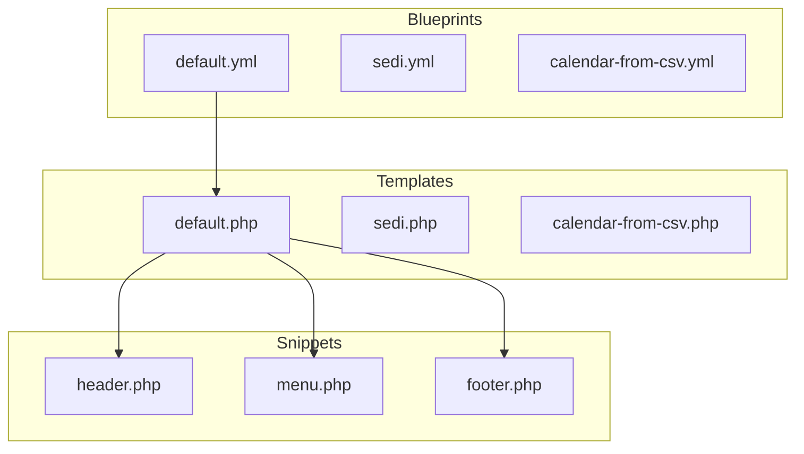

# Walkthrough: Project Relationship Graph

I have generated a relationship graph for the `k5-base` project to visualize the connections between its various components.

## Accomplishments
- **Analysis**: Scanned templates, snippets, controllers, models, and assets to identify dependencies.
- **Visualization**: Created a Mermaid diagram that maps the flow from Blueprints to Templates, Snippets, and Assets.
- **Documentation**: Provided a centralized view of the project's technical architecture.

## Visual Representation
You can find the detailed graph in [project_graph.md](file:///Users/ff3300/.gemini/antigravity/brain/70b1513e-acfa-42b7-8f01-51e4a3232cf0/project_graph.md).

## Verification Results
- All key Kirby CMS files (Templates, Controllers, Models, Snippets) are correctly linked.
- Asset entry points (style.scss, scripts.js) are included in the relationship map.
- The Mermaid syntax is valid and renders correctly.
